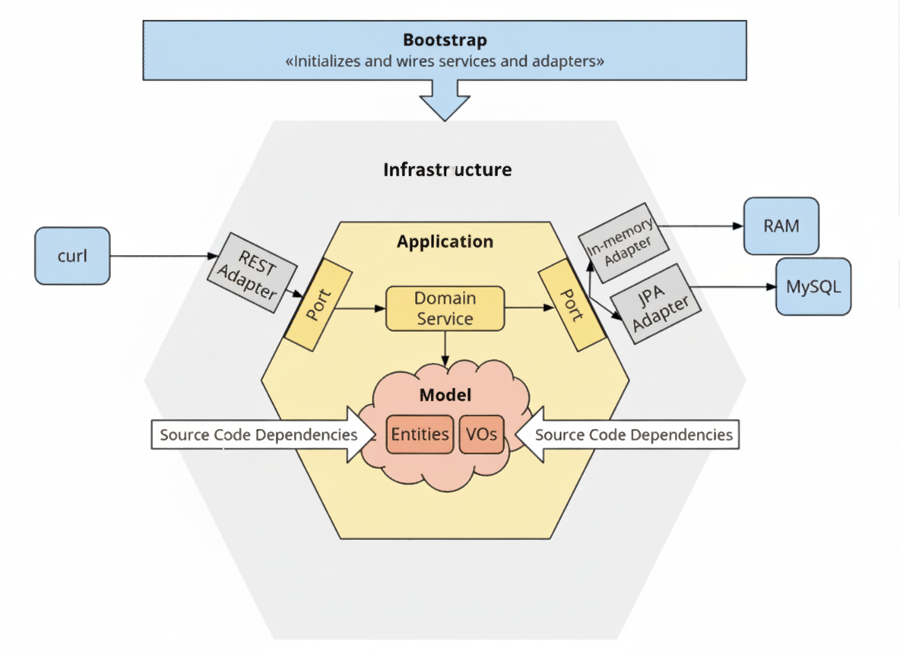

# Aplicação de Gestão Imobiliária

Aplicativo moderno de gestão imobiliária construído com Quarkus seguindo os princípios da Arquitetura Hexagonal. Projetado para gerenciar cadastro de imóveis, clientes e transações imobiliárias de forma escalável e desacoplada.


## 🚀 Tecnologias

- **Java 21** - Linguagem de programação
- **Quarkus 3.2.6** - Framework Java Supersônico e Subatômico
- **Arquitetura Hexagonal** - Separação clara entre domínio, aplicação e infraestrutura
- **RESTEasy Reactive** - Para construção de APIs REST reativas
- **Hibernate ORM com Panache** - Para operações de banco de dados
- **Kafka** - Para mensageria e comunicação assíncrona
- **Test Containers** - Para testes de integração
- **Mockito** - Para testes unitários
- **OpenAPI/Swagger** - Para documentação da API

## 📋 Pré-requisitos

- Java 21 ou superior
- Maven 3.9.0 ou superior
- Docker e Docker Compose
- PostgreSQL (pode ser executado via Docker)
- Kafka (pode ser executado via Docker)

## 🏗️ Estrutura do Projeto

O projeto está organizado em módulos seguindo os princípios da Arquitetura Hexagonal:

```
imobiliaria-app/
├── imobiliaria-app-bootloader/     # Ponto de entrada da aplicação
│   └── src/main/resources/application.properties  # Configurações
│
├── imobiliaria-app-application/    # Camada de aplicação
│   ├── src/main/java/com/imobiliaria/application/
│   │   ├── service/      # Serviços de aplicação
│   │   └── dto/          # Objetos de Transferência de Dados
│   └── pom.xml
│
├── imobiliaria-app-domain/         # Camada de domínio
│   ├── src/main/java/com/imobiliaria/domain/
│   │   ├── model/       # Entidades e agregados
│   │   └── port/        # Portas (interfaces)
│   └── pom.xml
│
└── imobiliaria-app-infrastructure/ # Camada de infraestrutura
    ├── src/main/java/com/imobiliaria/infrastructure/
    │   ├── persistence/  # Implementações de repositórios
    │   ├── messaging/    # Adaptadores para mensageria
    │   └── rest/         # Controladores REST
    └── pom.xml
```

## 🏃‍♂️ Iniciando o Projeto

### Modo Desenvolvimento
```bash
./mvnw quarkus:dev -pl imobiliaria-app-bootstrap
```

### Utilizando containers gerenciados

1. Inicie os serviços com Docker Compose:
```bash
docker-compose up -d
```

2. Execute a aplicação com profile test:
```bash
./mvnw quarkus:dev -Dquarkus.profile=test
```

Acesse a interface de desenvolvimento em: http://localhost:8080/q/dev/

### Executando Testes

Testes unitários:
```bash
./mvnw test
```

Testes de integração (requer Docker):
```bash
./mvnw verify -Pintegration-test
```

### Construindo a Aplicação

Pacote para produção:
```bash
./mvnw clean package
```

Construir executável nativo (requer GraalVM):
```bash
./mvnw package -Dnative -Dquarkus.native.container-build=true
```

## 📚 Documentação da API

Com a aplicação em execução, acesse:

- **OpenAPI UI**: http://localhost:8080/q/swagger-ui/
- **Esquema OpenAPI**: http://localhost:8080/q/openapi
- **Health Checks**: http://localhost:8080/q/health
- **Métricas**: http://localhost:8080/q/metrics

## 🔧 Configuração

As configurações principais estão em:
- `imobiliaria-app-bootloader/src/main/resources/application.properties`

Principais configurações incluem:
- Conexão com banco de dados
- Configurações do Kafka
- Porta do servidor
- Níveis de log

## 🤝 Contribuindo

1. Faça um fork do repositório
2. Crie uma branch para sua feature
3. Faça commit das suas alterações
4. Envie um Pull Request
4. Push to the branch
5. Create a new Pull Request

